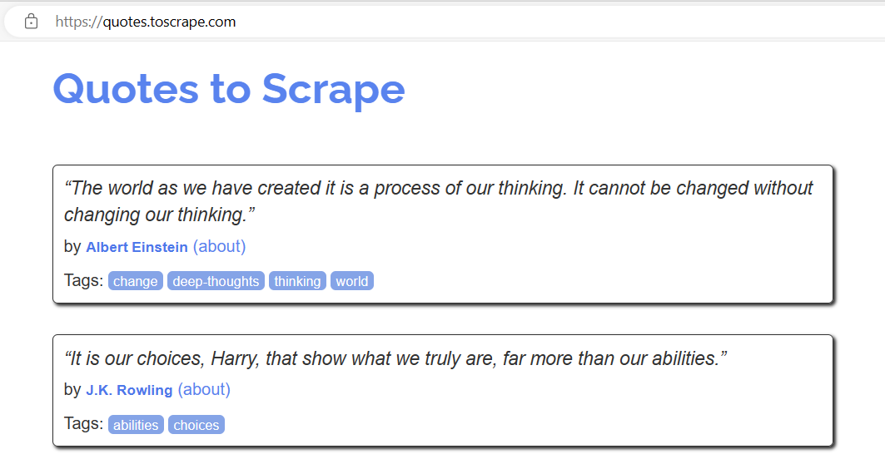

# Problem Statement

In the era of vast digital content, extracting meaningful insights from a diverse range of sources is crucial for understanding public sentiments and opinions. One valuable source of expressive content is quote websites, where individuals share their thoughts and perspectives on various aspects of life. The challenge lies in efficiently analyzing and visualizing the sentiments expressed by different authors in these quotes.

Our project aims to address this challenge by conducting sentiment analysis on a collection of quotes gathered from a prominent quote website. Through web scraping, we have obtained a dataset containing quotes along with their respective authors. The primary goal is to explore the sentiments conveyed by these authors and visualize the emotional tone of their quotes.

*Picture reference: [Quotes to Scrape](https://quotes.toscrape.com/)*

# Implementation

## Web Scraping for Quote Analysis

The first step involved web scraping from the target website (http://quotes.toscrape.com) to collect a rich dataset of quotes along with relevant metadata. Utilizing the Python programming language and libraries such as requests and BeautifulSoup, we sent an HTTP request to the target URL and successfully retrieved the HTML content of the page. The subsequent steps involved parsing the HTML to extract quote-related information.

### Quote Containers

Located and extracted all the quote containers on the page using BeautifulSoup. Each container encapsulates a quote, its author, associated tags, and a link to additional details.

### Data Extraction

Extracted quote text, author name, tags, and link for each quote container. Organized the extracted data into lists for subsequent analysis and presentation.

### DataFrame Creation

Compiled the extracted data into a structured DataFrame using the Pandas library. The DataFrame includes columns for Quote, Tags, Link, and Author, providing a clear overview of the gathered information.

*Picture reference: From executed Code*
