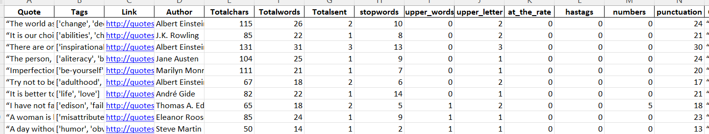

# Problem Statement

In the era of vast digital content, extracting meaningful insights from a diverse range of sources is crucial for understanding public sentiments and opinions. One valuable source of expressive content is quote websites, where individuals share their thoughts and perspectives on various aspects of life. The challenge lies in efficiently analyzing and visualizing the sentiments expressed by different authors in these quotes.
 
Our project aims to address this challenge by conducting sentiment analysis on a collection of quotes gathered from a prominent quote website. Through web scraping, we have obtained a dataset containing quotes along with their respective authors. The primary goal is to explore the sentiments conveyed by these authors and visualize the emotional tone of their quotes.

 

*Picture reference: [Quotes to Scrape](https://quotes.toscrape.com/)*

# Implementation

## 1. Web Scraping for Quote Analysis

The first step involved web scraping from the target website [Quotes toscrape](http://quotes.toscrape.com) to collect a rich dataset of quotes along with relevant metadata. Utilizing the Python programming language and libraries such as requests and BeautifulSoup, we sent an HTTP request to the target URL and successfully retrieved the HTML content of the page. The subsequent steps involved parsing the HTML to extract quote-related information.

 

### Quote Containers

Located and extracted all the quote containers on the page using BeautifulSoup. Each container encapsulates a quote, its author, associated tags, and a link to additional details.

 

### Data Extraction

Extracted quote text, author name, tags, and link for each quote container. Organized the extracted data into lists for subsequent analysis and presentation.

 

### DataFrame Creation

Compiled the extracted data into a structured DataFrame using the Pandas library. The DataFrame includes columns for Quote, Tags, Link, and Author, providing a clear overview of the gathered information.

## 2. Feature Engineering 

 

  
### Total Characters, Words, and Sentences  

  Calculated the total number of characters, words, and sentences for each quote.These metrics provide a quantitative understanding of the length and structure of the quotes.   

    
### Stopword Count

 Determined the count of stopwords in each quote using the NLTK library.Stopwords are common words that may not contribute significant meaning and can be indicative of writing style.

    
### Uppercase Words and Letters

Identified the count of uppercase words and individual uppercase letters in each quote.This feature sheds light on the use of emphasis and the presence of acronyms or proper nouns. 

      
### Words Starting with '@' (At the Rate)

 Quantified the occurrence of words starting with '@' in each quote.This is particularly relevant for identifying user mentions or references in social media-like contexts. 

        
### Hashtags,Numeric Characters & Punctuation Count

 
- Counted the occurrence of words starting with '#' in each quote. Hashtags may indicate trending topics or thematic emphasis within the quotes.  
- Computed the count of numeric characters in each quote.  
- Useful for understanding the inclusion of numerical information in the quotes.  
- Calculated the count of punctuation marks in each quote.Punctuation analysis provides insights into writing style and the emotional tone of the quotes.
- Removed quotation marks, periods, commas, and apostrophes from each sentence to ensure a clean and coherent representation.

 

## 3. Text Preprocessing and Advance analysis

 
In our ongoing effort to refine the dataset for sentiment analysis and insightful exploration, we implemented advanced text preprocessing techniques. Specifically, we focused on removing stopwords and conducted a comprehensive analysis of the updated text.

### Stopword Removal

 
- Utilized NLTK's list of English stopwords to remove common words that may not contribute significant meaning.
- Implemented a custom function to remove stopwords from each quote.

### Updated Quote Column

 
- Created a new column, 'Quote_Upd,' containing quotes after the removal of stopwords.

### Stopword and Uppercase Analysis After Preprocessing

 
- Calculated the count of stopwords, uppercase words, and uppercase letters in the updated quotes.
- This analysis provides insights into the impact of stopword removal on the composition of the quotes.

### Words Starting with '@' (At the Rate) and Hashtags After Preprocessing

 
- Quantified the occurrence of words starting with '@' and '#' in the updated quotes.
- This analysis reveals changes in social media-style content after stopword removal.

### Numeric Characters and Punctuation After Preprocessing

 
- Examined the count of numeric characters and punctuation marks in the updated quotes.
- This analysis highlights shifts in numerical information and punctuation usage.

 

 

## 4. WordCloud Visualization for Extracted Quotes

In our continued efforts to visually represent the essence of the quotes in a captivating manner, we created a WordCloud visualization using the cleaned and preprocessed text.

 

### WordCloud Generation

 
- Utilized the WordCloud library to generate a visually appealing WordCloud image.  
- The cleaned and preprocessed text was used as the input for WordCloud creation.

 

# Insights

 The WordCloud analysis of the quotes dataset reveals a thematic landscape centered around key concepts. Prominent words such as "absolute," "without," "miracle," "thinking," "better," "know," and "ways" offer a consolidated perspective on the prevalent themes within the dataset

### Certainty and Principles

 The presence of "absolute" suggests a focus on certainty, unwavering principles, or fundamental truths within the quotes. 
 

### Freedom and Simplicity

 The inclusion of "without" indicates a thematic exploration of freedom from constraints, simplicity, and unburdened perspectives.

### Wonder and Extraordinary Occurrences

 The word "miracle" introduces a theme of wonder, magic, and the recognition of extraordinary occurrences in everyday life.

### Cognitive Processes and Reflection

 The emphasis on "thinking" suggests a focus on thoughts, cognitive processes, and reflective perspectives within the quotes.

### Improvement and Positive Change

 The presence of "better" indicates a thematic emphasis on improvement, growth, and the pursuit of positive change.

### Knowledge and Understanding

 The word "know" highlights a thematic exploration of knowledge, wisdom, and the pursuit of understanding.

### Diverse Approaches and Paths

 The inclusion of "ways" suggests a focus on diverse approaches, paths, or methods in navigating life's challenges.

### Overall Tone

 The WordCloud reflects a diverse and introspective collection of quotes that touch upon themes of certainty, simplicity, wonder, cognitive processes, improvement, knowledge, and diverse approaches.

# Next steps

 As we proceed with sentiment analysis and more comprehensive exploration, we anticipate uncovering nuanced emotions and gaining a deeper understanding of the underlying messages within the quotes. 

